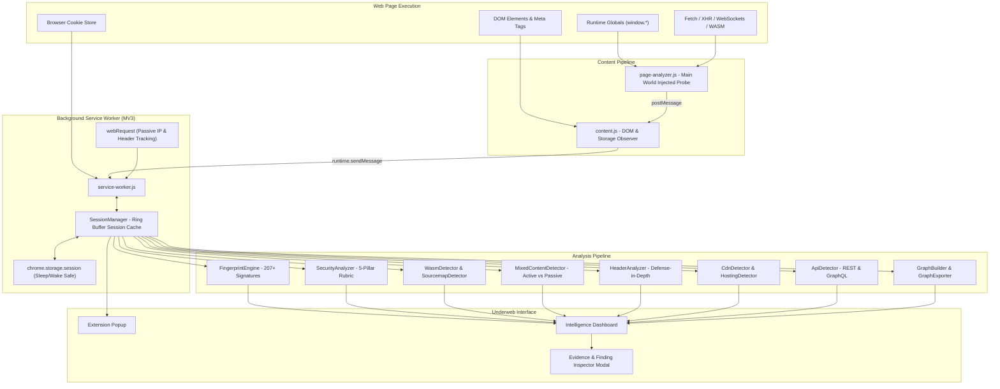

# Underweb

> "Explore the technology beneath every website."

[](LICENSE)
[](https://github.com/amrnath005/Underweb/actions)
[](https://developer.chrome.com/docs/extensions/mv3/intro/)
[](tests/test-runner.js)
[-blueviolet.svg)](#privacy)
[](#try-it-in-30-seconds)
[](https://amrnath005.github.io/Underweb/)

Underweb turns any website into an evidence-backed technical blueprint — technology stack, network, APIs, infrastructure, security, browser APIs, and architecture.

Built as an open-source Manifest V3 extension for Chromium and Firefox, Underweb functions as a hybrid website analyzer, network inspector, and architecture explorer. It replaces guesswork with concrete, verifiable browser evidence.

---

## Live Interactive Playground

Try Underweb directly in your browser without installing the extension:
[Launch Underweb Live Web Playground](https://amrnath005.github.io/Underweb/)

Pre-loaded with recorded real-world production stack snapshots:
- Modern Next.js SaaS: App Router, React 19, Tailwind CSS, Stripe, GraphQL, Vercel Edge.
- Enterprise Shopify Store: Liquid, Storefront API, CDN assets, checkout telemetry.
- High-Traffic WordPress: Gutenberg core, WooCommerce, REST API, Redis/Cache headers.

---

## What Can Underweb See?

```
+---------------------------------------------------------------------------------------+
|                                    UNDERWEB CONSOLE                                   |
+---------------------------+---------------------------+-------------------------------+
| Technology Detection      | Network Intelligence      | API Detection                 |
| 206+ observable stack     | Remote server IPs, HTTP/2 | Automatic REST and GraphQL    |
| signatures across modern  | and HTTP/3 QUIC, transfer | cataloging, operation names,  |
| frameworks, CSS, libraries| sizes, and eTLD+1 party   | timing, and WebSocket socket  |
| build tools, and CDNs.    | attribution boundaries.   | connection profiling.         |
+---------------------------+---------------------------+-------------------------------+
| Infrastructure Mapping    | Security & Privacy Audit  | Architecture Graph            |
| End-to-end delivery path: | 5-pillar posture scoring, | Force-directed dependency     |
| Client -> Remote IP / ASN | CSP, HSTS, active/passive | graph with Dijkstra shortest  |
| -> CDN Edge -> Host.      | mixed content, & cookies. | path & betweenness centrality.|
+---------------------------+---------------------------+-------------------------------+
| Browser APIs              | Evidence & Confidence     | Interaction Investigator      |
| Storage keys, canvas,     | Every detection cites its | Records cause-and-effect:     |
| WebGL, Web Audio, sensors,| exact signal source with  | Click -> DOM -> API Request   |
| and permission surfaces.  | probabilistic confidence. | -> Response -> Storage Update.|
+---------------------------+---------------------------+-------------------------------+
```

---

## Why Underweb?

Most web technology detectors operate on superficial URL string matching or fabricate internal components. Underweb is designed for engineers who want technical accuracy:

- **Browser-First and 100% Local-First**: Runs entirely within your browser process. Zero third-party telemetry, zero external APIs, and zero data exfiltration.
- **Evidence-Backed Detection**: Every technology identified is anchored to an inspectable `EvidenceRecord` citing the exact runtime global, DOM node, or HTTP response header that proved its presence.
- **Observable vs. Inferred Differentiation**: Directly observed technologies are clearly separated from architectural inferences. If a framework implies a parent (e.g. Next.js implying React), the inference relationship is explicitly labeled.
- **No Fabricated Backend Claims**: Underweb will never guess invisible backend components. Unless an explicit response header or cookie provides proof, it will never claim to detect internal databases (PostgreSQL, MySQL, Redis, MongoDB) or internal orchestration (Docker, Kubernetes).
- **WebAssembly & Source Map Auditing**: Deeply profiles `.wasm` binary payloads to attribute compiler toolchains (Rust `wasm-bindgen`, Go/TinyGo, Emscripten, AssemblyScript) while passively detecting exposed production source maps.
- **One-Click Diagram & Vector Export**: Export active architecture dependency graphs directly into GitHub-ready Mermaid Markdown diagrams or standalone vector SVG files.
- **Dual-Engine Browser Support**: Ships optimized Manifest V3 distributions for Chromium browsers (Chrome, Edge, Brave, Opera) and Mozilla Firefox (Gecko MV3).
- **Zero AI API or Cloud Dependencies**: Deterministic, offline-capable analysis engines ensure reproducible, instant results without subscription fees or rate limits.

---

## Real-World Detection in Action

Underweb inspects multiple execution tiers simultaneously:

```text
React       — OBSERVED — HIGH (94% confidence)
GraphQL     — OBSERVED — HIGH (89% confidence)
Cloudflare  — OBSERVED — HIGH (96% confidence)
Fastify     — OBSERVED — MEDIUM (74% confidence)
Tailwind    — OBSERVED — HIGH (91% confidence)
Rust WASM   — OBSERVED — HIGH (95% confidence)
```

### Traceable Evidence Breakdown
```text
[✓ Runtime Signal]   window.React detected (version 18.3.1); window.__APOLLO_CLIENT__ present
[✓ Network Signal]   POST /api/v2/graphql with JSON payload containing query "GetCatalogData"
[✓ Header Signal]    cf-ray: 8df4a1b0-ORD; server: cloudflare; x-powered-by: Fastify
[✓ DOM Signal]       Tailwind utility token signatures detected across 42 DOM nodes
[✓ WASM Signal]      wasm-bindgen naming convention (_bg.wasm) loaded at /pkg/engine_bg.wasm
```

---

## System Architecture



---

## Installation & Usage

### Option 1: Unpacked Developer Mode (Chrome, Edge, Brave, Opera)
1. Clone the repository:
   ```bash
   git clone https://github.com/amrnath005/Underweb.git
   cd Underweb
   ```
2. Open extension management:
   - Google Chrome / Brave: `chrome://extensions/`
   - Microsoft Edge: `edge://extensions/`
3. Enable **Developer mode** toggle in the top-right corner.
4. Click **Load unpacked** and select the repository root folder.
5. Pin the Underweb icon to your browser toolbar.

### Option 2: Mozilla Firefox (Gecko MV3)
1. Build the Firefox target:
   ```bash
   npm run build:firefox
   ```
2. In Firefox, navigate to `about:debugging#/runtime/this-firefox`.
3. Click **Load Temporary Add-on...**.
4. Select `dist/firefox-package/manifest.json` (or `dist/Underweb-Firefox.zip`).

### Option 3: Automated Production Bundling
Underweb includes zero-dependency packaging scripts that validate manifest integrity, AST syntax, module imports, and bundle standard zip files:
```bash
npm run build:edge      # Generates dist/Underweb-Edge.zip
npm run build:firefox   # Generates dist/Underweb-Firefox.zip
npm run build:all       # Builds and verifies both targets
```

---

## Capabilities & Implementation Status

| Module | Core Functionality | Status | Test Coverage |
| :--- | :--- | :--- | :--- |
| **Technology Fingerprinting** | 207+ modular signatures (Globals, DOM, Scripts, Headers, Cookies) | Active | 100% (Suites 7-15) |
| **Network Engine** | Real remote IP capture, HTTP/2 & HTTP/3 QUIC, transfer sizing | Active | 100% (Suites 2, 5) |
| **API Cataloger** | REST endpoints, GraphQL operations, WebSocket handshake profiling | Active | 100% (Suites 2, 6) |
| **Infrastructure Resolver** | ASN registry mapping, CDN edge headers, hosting detection | Active | 100% (Suite 5) |
| **Security Analyzer** | 5-pillar scoring + passive source map exposure auditing | Active | 100% (Suites 16, 18) |
| **Architecture Graph & Exporters** | Force-directed canvas, Dijkstra shortest path, Mermaid & SVG export | Active | 100% (Suites 3, 17) |
| **WebAssembly Analyzer** | Binary inspection and toolchain attribution (Rust, Go, Emscripten, AssemblyScript) | Active | 100% (Suite 18) |
| **Signature Validator CLI** | Strict observable evidence schema enforcement & duplicate prevention | Active | 100% (CI matrix) |
| **Interaction Investigator** | "What Happens When I Click?" event-to-request causal recorder | Active | Verified |
| **Student Learning Mode** | WHAT, WHY, HOW, EVIDENCE educational reference cards | Active | Verified |

---

## Built for Developers, Students & Security Researchers

- **Frontend & Full-Stack Engineers**: Discover the exact libraries, bundlers, and styling systems powering your favorite web applications.
- **Cybersecurity Researchers**: Audit defense-in-depth header configuration, identify active mixed content, check cookie isolation flags, detect exposed source maps, and map third-party tracking surfaces.
- **Computer Science Students**: Learn how real-world websites work under the hood. Run classic graph algorithms (BFS, DFS, Dijkstra, Centrality) against live website architectures.
- **API Designers & Integrators**: Discover undocumented REST endpoints, observe GraphQL query schemas, and examine WebSocket protocols in action.

---

## Privacy

Underweb is built on a strict privacy model:

- **Zero Outbound Telemetry**: Underweb does not send HTTP requests to remote analytics servers, third-party trackers, or cloud storage.
- **No Third-Party Cookies or Identifiers**: Underweb creates no cross-site identifiers or telemetry beacons.
- **Local Storage Only**: Inspected history and user configuration reside solely in local extension storage (`chrome.storage.session` and local `IndexedDB`).
- **Strict Content Security Policy**: Configured with `script-src 'self'; object-src 'self'`. No `unsafe-eval`, no `unsafe-inline`, and no remote script execution.

---

## Permissions & Usage Rationale

Underweb requests only permissions necessary to observe the active page:

| Permission | Technical Rationale |
| :--- | :--- |
| `webRequest` | Passively captures request headers, status codes, protocols, and remote server socket IPs (`details.ip`). |
| `cookies` | Reads cookie flags (`HttpOnly`, `Secure`, `SameSite`) on the inspected domain for security posture auditing. |
| `storage` | Preserves tab session data across service worker sleep/wake cycles and stores local user preferences. |
| `scripting` | Executes non-invasive DOM checks and read-only runtime global probes. |
| `tabs` & `activeTab` | Resolves the URL, title, and ID of the current tab to bind telemetry to the dashboard. |
| `<all_urls>` | Allows inspecting public websites navigated by the user. |

---

## Technical Limitations

Underweb operates transparently within the security boundaries of standard browser extensions:

1. **Browser-Observable Evidence Only**: Underweb cannot inspect backend databases (PostgreSQL, MySQL, Redis, MongoDB) or container orchestration (Docker, Kubernetes) unless an explicit server header or debug artifact is exposed in the HTTP response.
2. **Pre-Existing Tabs**: If Underweb is installed or reloaded while tabs are already open, response headers from the initial document navigation were not observed. Underweb flags these sessions as `PARTIALLY_ASSESSED` to avoid applying unobserved header penalties until the tab is refreshed.
3. **Encrypted Cross-Origin Iframes**: Subresources loaded inside sandboxed cross-origin iframes without content script permissions cannot be deeply inspected.

---

## Verification & Automated Tests

Underweb includes a zero-dependency automated test suite running 147 test assertions across 18 test suites:

```bash
npm test              # Executes zero-dependency test runner
npm run validate      # Audits all 207 signatures against the Zero Fabrication rule
npm run build:all     # Validates AST syntax, module imports, and creates release zip bundles
```

```text
--- Suite: Universal Fingerprint Detection Engine ---
  ✔ PASS: Detects React from globals & DOM markers
  ✔ PASS: Detects Tailwind CSS from DOM class utility marker
  ✔ PASS: Detects Cloudflare from cf-ray and server headers
...
--- Suite: Security Analyzer & Evidence-Driven Posture Scoring ---
  ✔ PASS: HTTPS site is fully ASSESSED
  ✔ PASS: REGRESSION FIXED: HTTPS site with passive HTTP image is NOT Grade F
  ✔ PASS: Active mixed content (script) is flagged with HIGH severity
  ✔ PASS: CSP frame-ancestors provides clickjacking protection
...
--- Suite: Architecture Graph Exporters (Mermaid & SVG) ---
  ✔ PASS: toMermaid returns string
  ✔ PASS: toSvg returns string
...
--- Suite: Deep WebAssembly & Sourcemap Telemetry ---
  ✔ PASS: Detects base WebAssembly binary payload
  ✔ PASS: Correctly attributes Rust (wasm-bindgen) toolchain
  ✔ PASS: Detects Go / TinyGo wasm_exec runtime
  ✔ PASS: Detects Emscripten C/C++ toolchain
  ✔ PASS: Detects AssemblyScript compiler output
  ✔ PASS: Detects exposed source map files or headers

========================================
Test Execution Finished: 147 Passed, 0 Failed
========================================
```

---

## Roadmap

- [x] Automated CI testing workflow via GitHub Actions matrix across Node 18, 20, and 22.
- [x] Interactive Live Web Playground hosted via GitHub Pages with realistic pre-loaded stack snapshots.
- [x] One-click architecture diagram export in Mermaid Markdown and vector SVG formats.
- [x] Deep WebAssembly (WASM) compiler toolchain attribution and source map auditing.
- [x] Mozilla Firefox Add-ons (Manifest V3 Gecko) packaging and distribution pipeline.
- [ ] Deep HTTP/3 0-RTT and QUIC connection parameter telemetry.
- [ ] Headless CLI runner for automated CI/CD website auditing.

---

## Contributing

Contributions are welcome! Please read [CONTRIBUTING.md](CONTRIBUTING.md) for details on adding technology signatures, writing unit tests, and adhering to our evidence standards.

The Underweb Standard:
> "Detect everything observable. Infer only what evidence supports. Mark everything else UNKNOWN."

---

## Support the Project

If Underweb helps you understand what's happening beneath the web, star the repository and help others discover it.

---

## License

Distributed under the **MIT License**. See [LICENSE](LICENSE) for more details.
Built for developers, cybersecurity researchers, students, and curious internet explorers.
